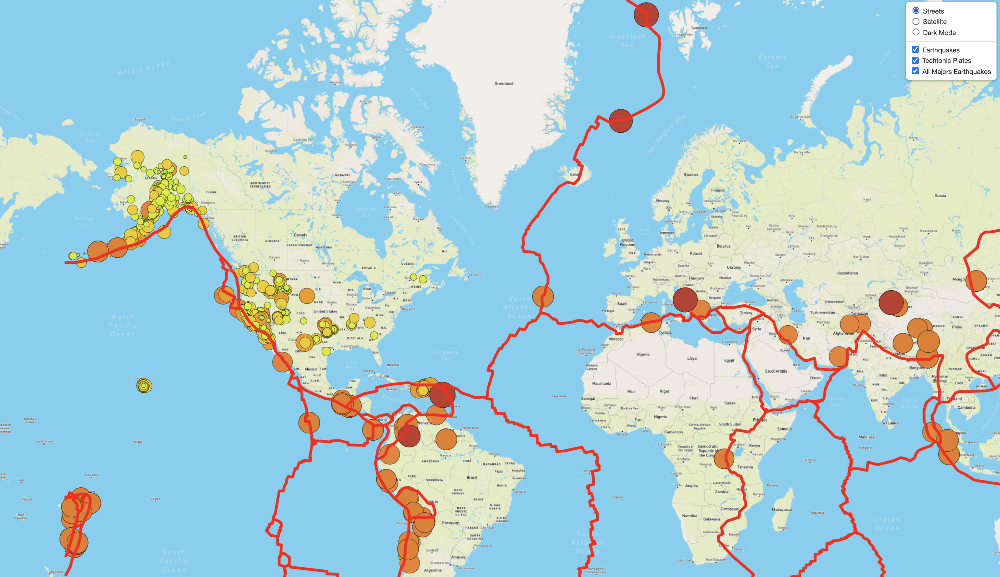

# Mapping Earthquakes with Mapbox

## Project Overview

This project presents an interactive dashboard and visualize the recent earthquakeson using public JSONs.

## Resources

- Dataset: PB2002_boundaries.json, all_week.geojson and 4.5_week.geojson (Online dataset)
- Software: HTML/CSS, JavaScript, Visual Studio Code 1.54, MapBox and D3
